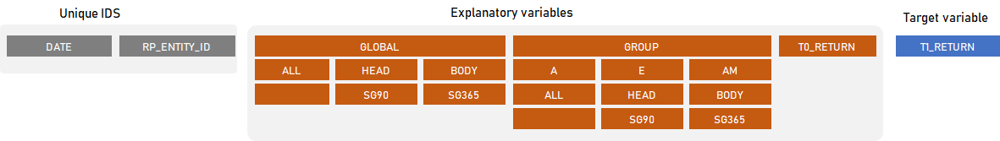
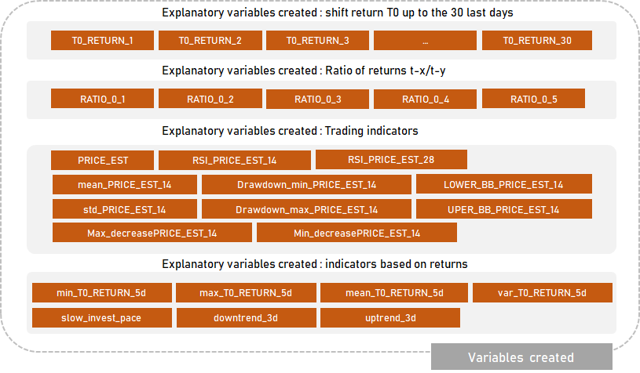
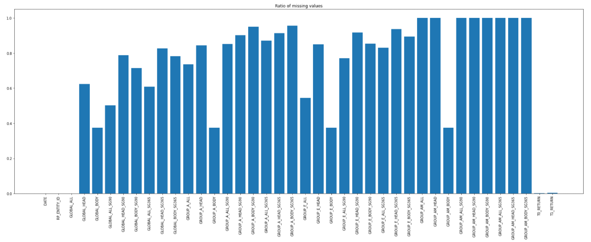
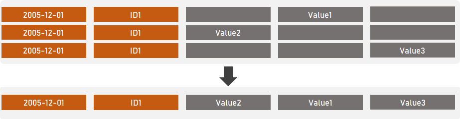
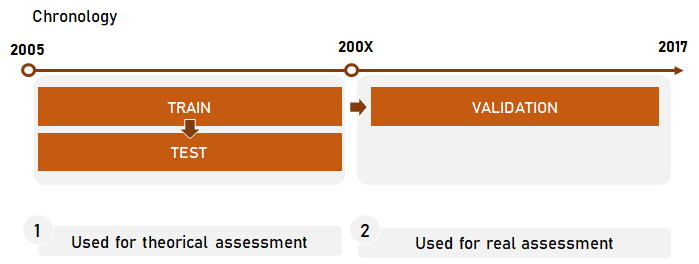
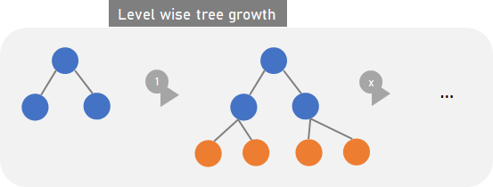
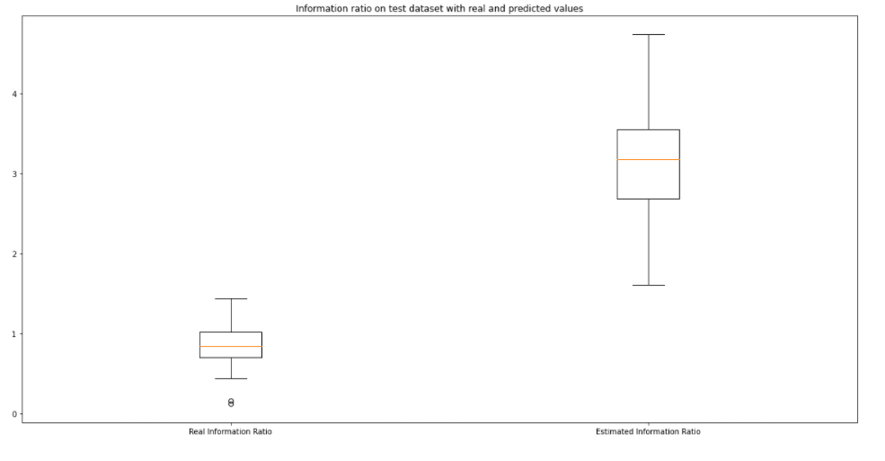
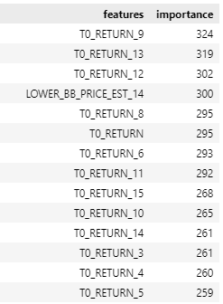
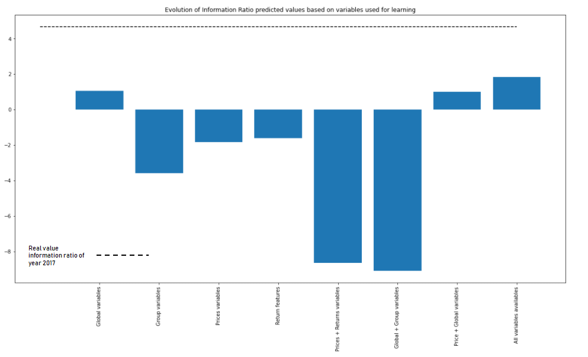
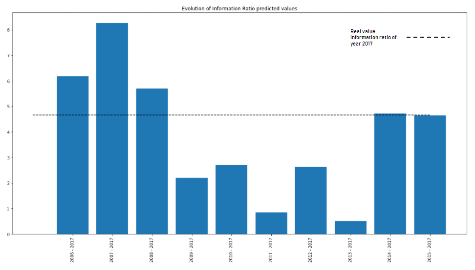

# Log-return prediction : Automation

Candidate : Arnaud Tauveron

Workload of the project :
- Monday : 2 hours : building the .ipynb file
- Tuesday : 5 hours : developing the .ipynb file and packaging of the .ipynb
- Tursday : 5 hours : code cleaning and report writing
- Friday : 6 hours : Finalization of the results + the report

<br />

<br />


## 1 - Introduction 
The project has been developed in the course of an assessment. The goal is to implement an algorithm of prediction of return of multiple financial assets ('T1_RETURN') based on the existing and computed informations.

All the developements have been made in a course of 5 days of work.

<br />

<br />


## 2 - Project Packaging
### 2.1 - Package

```
├── data                                    <- All data use for the project
├── src                                     <- Ingestion, Preparation, Modeling, Exposition folder with all necessary methods
│   ├── loaderpy.py                               <- methods used to load the data 
│   ├── preprocesspy.py                           <- methods used to preprocess the data including all the features engineering
│   ├── trainpy.py                                <- methods used to train the model and assess the model
│   ├── utilspy.py                              <- methods used to save 'static' methods
│   ├── predictpy.py                              <- methods used to call the model                              -- *This file has not been added in the course of this project*
│   ├── wrapperspy.py                             <- methods wrappers in case of shell files use (to be updated) -- *This file has not been added in the course of this project*
│   └── apipy.py                                  <- Contains methods to call api (to be added)                  -- *This file has not been added in the course of this project*
├── output                                  <- Folder contains all results
├── doc                                     <- Folder contains all .png
├── setup.py                                <- Setup file to build python package '''python -m pip install -e .'''
├── main.py                                 <- Main file used to run the project
├── configeval.yaml                         <- Configuration file used to setup the evaluation step and generate multiples outputs
├── README.md                               <- ** REPORT OF THE PROJECT **
├── assessment_AT.ipynb                     <- ** TECHNICAL REPORT OF THE PROJECT **
└── LICENSE
```

### 2.2 - Package usage
All the files in the folder /src are the necessary methods to build a python model.

The configeval.yaml enable to use the package for specific purposes and test such as testing a particular year date, learning on a specific range.

The file main.py has to be executed to launch the evaluation process.

And I would be happy to discuss on this matter.

<br />

<br />

## 3 - Data & Preprocess
The data used in the project are the following:



From these variables multiples indicators were built such as : 
- shift returns in order to integrate past returns in the learning : "T0_RETURN_X" 
- ratio of returns in order to retrieve the growth over different period of times
- trading indicators to spot the trend of the market
- seasonal indicators such as day of week and month



More than 50 variables were added and after unested them I have a number of 93 variables used in the process of learning.

<br />

### 3.1 - Removing duplicate information
I noticed the missing values were due to duplicates rows for each customers at each dates.



As the data was scattered over the rows, the idea was to fill the missing value by date, entity and keep the first row which hold all the necessary information.

The graphic below shows the basic transformation done before creating machine learning models.



<br />

<br />


## 4 - Methodology of analysis & Package usage

<br />

### 4.1 - Methodology
The metholody used includes : 

1- Analysis of the model performance on the same period of time referring to train/test tables

2- Analysis of the model performance in real time referring to different period of time train/validation tables



For both steps we assess the performance of the model using statiscal indicators : 
- [R2](https://scikit-learn.org/stable/modules/generated/sklearn.metrics.r2_score.html)
- [Mean Square error](https://scikit-learn.org/stable/modules/generated/sklearn.metrics.mean_squared_error.html)
- [Correlation coefficient](https://numpy.org/doc/stable/reference/generated/numpy.corrcoef.html)
- [Mean absolute error](https://scikit-learn.org/stable/modules/generated/sklearn.metrics.mean_absolute_error.html)

and the score used to asses this project is the [Information Ratio](https://www.investopedia.com/terms/i/informationratio.asp) (which has been developed in python under the function [score_model](./src/utilspy.py)).

```
def score_model(
    df: pd.DataFrame,
    var_id: str = "RP_ENTITY_ID",
    var_target: str = "T1_RETURN",
    var_SG90: str = "GROUP_E_ALL_SG90",
    var_date: str = "DATE",
) -> float:
    df_copy = (
        df[[var_date, var_id, var_SG90, var_target]]
        .dropna(axis=0)
        .drop_duplicates()
        .copy()
    )
    res_df = (
        df_copy.groupby(var_date)
        .apply(
            lambda x: pd.Series(
                {"AVGRET": np.mean(np.sign(x[var_SG90]) * x[var_target])}
            )
        )
        .reset_index()
    )
    # AnnualizedReturn
    AnnualizedReturn = np.mean(np.log(res_df.AVGRET + 1)) * 252
    # AnnualizedVolatility
    AnnualizedVolatility = np.sqrt(np.var(np.log(res_df.AVGRET + 1))) * np.sqrt(252)
    # Information Ratio
    InformationRatio = AnnualizedReturn / AnnualizedVolatility
    return InformationRatio
```

### 4.2 - Machine learning model
The machine learning model used in this process is a [light gradient boosting](https://lightgbm.readthedocs.io/en/latest/) which is both : fast & reliable.
Classical tree algorithms (gradient boosting and random forest) use a level wise growth for the trees.



LGBM algorithm uses a leaf wise growth which implies faster decision and prevents unnecessary overlearning.


For this project I set the number of trees created up to 300 and a regularization L2 coefficient equals 0.5 to prevent overfitting. In order for the recursive algorithm to be sufficiently trained while penalizing correlated variables.
Note I did not dedicated this project to algorithms benchmarking which I would usually do with the package [hyperopt](http://hyperopt.github.io/hyperopt/).

<br />

<br />


## 5 - Results 

<br />

### 5.1 - Results in a train test process
In this process 50 train/test datasets were made and 50 models were created. The training dataset and testing data set are based on the same temporal data from 2005 to 2017.
The model tends to over estimate the Information Ratio in comparison to the normal in most of the case.



Regarding the features importance, the returns based features are taking all the importance followed by the financial indicators and then "group" and "global" variables.



```
Its opens the door to a entity base model which will reorder the feature variables and as well won't be bias by variables from other assets which might not have the same business characteristics.

```

### 5.2 - Results of a chronological process
The chronological process is the closest to the reality as the dataset used for the modeling and the prediction are independant in a chronological basis which means the data don't overlap.

Due to the combinatory issues regarding the range of learning and the date of test to choose.

I fixed the prediction date on : 2017 and use all past data to build multiple machine learning models.

#### 5.2.1 - All family of variables have to be used to bring a more efficient model
One of the finding is linked to the power of variables when they are used independently. 



```
All families of variables have to be considered to build the most performing model.
```


#### 5.2.2 - The period of learning greatly impact the predictive power of the model
Depending of the number of years of learning the information ratio varies a lot from a more bearish to a more bullish one in comparison to the date of learning.
In the following graph we have the different values of Information ratio depending of the period of learning.



The impact of the 2008 crisis can be seen as the models tends to be much more bearish in its predictions after 2008. It's due to the recover of the economy and slow reinvestments.
On the contrary starting from 2014 the model taking 2 years of learning fits very well the information ratio for the year of 2017.

```
Global market context is key to not bias the learning of the model and reach better performances. The best way to overcome this issue is by keeping only the information in the market period : post-crisis, antes-crisis, during crisis.
```

### 5.3 - Take away
The current modeling is still lacking behing when it comes on statistical indicators : 
- R2
- correlation

and performs well on others:
- mean error square 
- mean absolute error

due to the small values of returns.

```
However this project highlight strong facts: 
- Model instability depending of the data used in the learning (removing one year of learning can change the IR results completely for high to lower)
It's not surprise because it's linked to the global market context including the crisis of 2008 for instance. But as well the investors behaviors towards the assets which changed over time as well.

- Including all the asset whitout regards of their characteristics create bias
- A model based at an entity level is sometimes more efficient
- Group and Global variables are not the most relevant features when returns based features are used
```

<br />

<br />

## 6 - Axes of improvements

<br />

### 6.1 - Automatic feature generator and assessment
Regarding the time allocated to the project I did not added an automatic features generator and selector based on : 
- log, root-square, variable association for feature generation
- lasso/ridge/elnet selection (from sklearn package) and correlation/student-test/... for features selection (yet they were integrated in the model lgbm directly).

<br />

### 6.2 - More data
#### 6.2.1 - Market industry data
One of the improvement that I did not implement is to consider market information (from pandas_datareader package) such as : 
- healthcare industry market returns 
- energy industry market returns
- technology industry market returns

The idea is to consider the market as temporal communicating vessels in which some assets from one industry are outperforming other one from the same industry and vice versa.

In fact the representation of  https://finviz.com/map.ashx illustrates quick well how the market can behave globally and by industries.

Knwowing this information would have been able to draw the correlation among the market over time and integrate the information within the model, so that it guess that when a market pumps it's a the expenses of others.

#### 6.2.2 - Company information
The idea behind is to retrieve information relative to major developments from the companies : 
- new incoming products
- new partnerships 
- insider trading 
- EPS
- company awareness
- company option pricing
- ... 

The only issue with this approach is the non regular base of information which would lead ot lot of missing values as for the dataset used in the project.

<br />

### 6.3 - Methodology
In fact the current situation could be splitted in 2 steps : 
- one dedicated to identifying the sens of return : positive or negative 
    - we could dig in a smaller scope usign binary/multi-class supervised learning such as detecting high potential / low potential returns either positives or negatives
- another one to identify the amplitude of the incoming return
